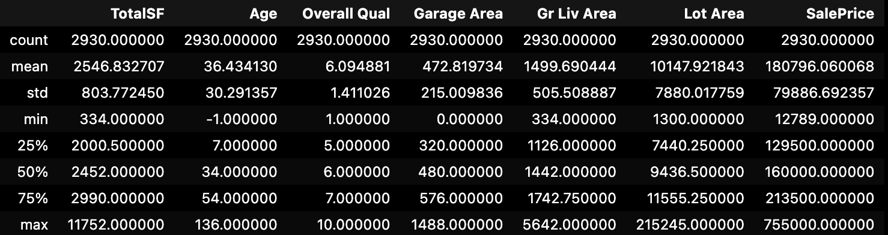
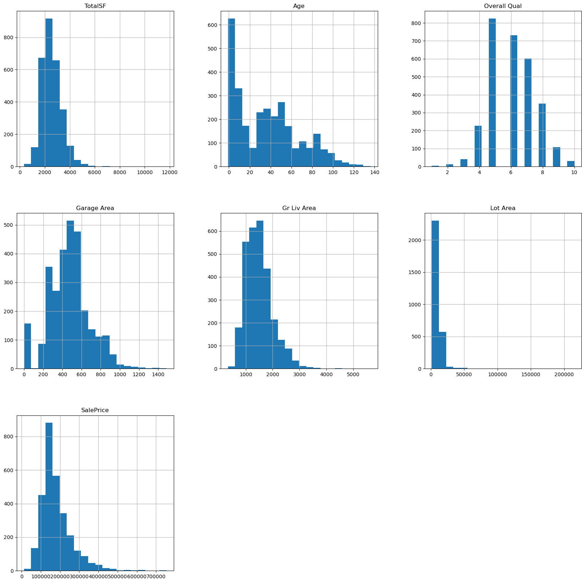
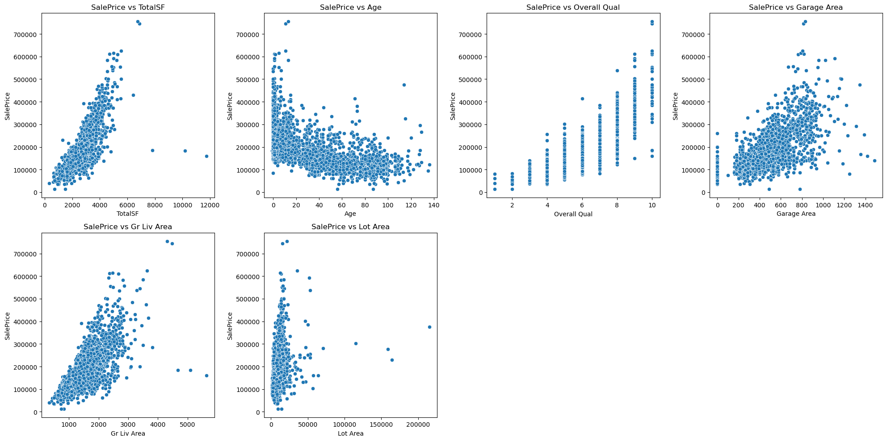
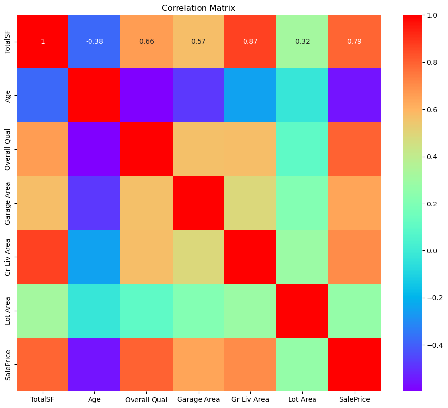
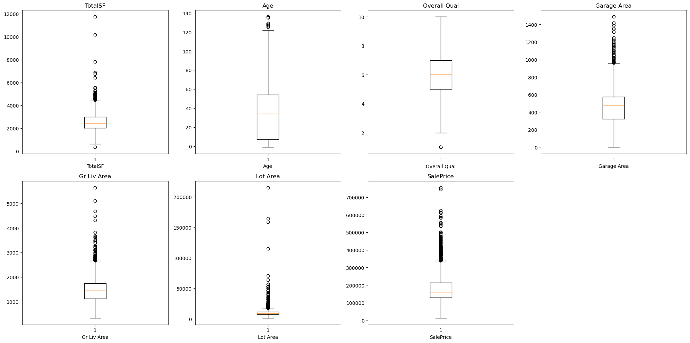
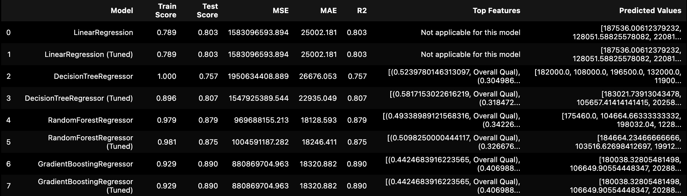
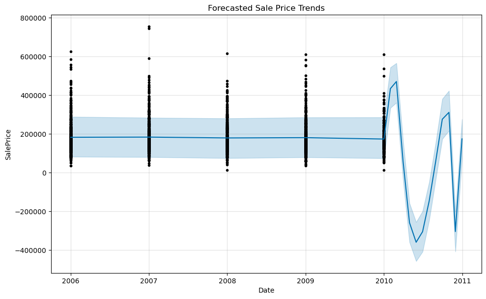

# Ames Housing Price Prediction and Forecasting

## Table of Contents
1. Overview
2. Dataset
3. Dependencies
4. Data Preprocessing
5. Exploratory Data Analysis (EDA)
6. Model Training and Evaluation
7. Hyperparameter Tuning
8. Forecasting Future Trends
9. Results
10. Conclusion
11. Usage

## Overview
This project aims to analyze the Ames Housing dataset to predict house prices using various regression models and to forecast future trends using the Facebook Prophet model. The project involves data preprocessing, exploratory data analysis (EDA), model training and evaluation, hyperparameter tuning, and time series forecasting.

## Dataset
The dataset used in this project is the Ames Housing dataset from Kaggle, which includes numerous features describing houses in Ames, Iowa, along with their sale prices. The dataset can be accessed [here](https://www.kaggle.com/datasets/shashanknecrothapa/ames-housing-dataset)

## Dependencies
The project requires the following Python libraries:
* pandas
* numpy
* matplotlib
* seaborn
* scikit-learn
* prophet

These libraries can be installed using pip. Ensure you have them installed before running the code.

## Data Preprocessing

### Loading the Data
The first step involves loading the dataset and examining its structure. This includes checking the data types of each column and displaying the first few rows of the dataset to get an initial understanding of the data.

### Handling Missing Values
Missing values are identified and handled appropriately. Numerical features are imputed with their mean values to ensure there are no gaps in the data, which could otherwise affect the performance of the machine learning models.

### Feature Engineering
New features are created to enhance the dataset. For example, `TotalSF` is the sum of the first floor, second floor, and basement square footage, and `Age` is the difference between the year sold and the year built. These features can potentially improve the predictive power of the models. 

### Selecting Important Features
Key features relevant to predicting the house prices are selected. This step reduces the dimensionality of the dataset and focuses on the more impactful variables.

## Exploratory Data Analysis
EDA helps to understand the underlying patterns and distributions in the data. Several visualization techniques are employed:

### Summary Statistics
Summary statistics provide an overview of the dataset, including measures of central tendency and variability. 

### Histograms
Histograms are plotted for numerical features to visualize their distributions. This helps in understanding the spread and skewness of the data.

### Scatter Plots
Scatter plots are used to visualize the relationships between numerical features and the target variable `SalePrice`. This helps in identifying any correlations.

### Correlation Heatmap
A heatmap is generated to visualize the correlation between different features. Features with high correlation to the target variable are of particular interest.

### Box Plots
Box plots are used to identify outliers in numerical features. Outliers can significantly affect the performance of machine learning models and may need to be handled appropriately. 

## Model Training and Evaluation

### Splitting the Data
The dataset is split into training and testing sets to evaluate the models' performance. The training set is used to train the models, and the testing set is used to evaluate how well the models generalize to unseen data.

### Model Evaluation
Several regression models are trained and evaluated, including:

**Linear Regression** 

**Decision Tree Regressor**

**Random Forest Regressor**

**Gradient Boosting Regressor**

Each model's performance is measured using metrics such as Mean Squared Error (MSE), Mean Absolute Error (MAE), and R-squared ($R^2$)

### Feature Importance
For tree-based models, feature importance scores are calculated to identify the most influential features in predicting house prices. This helps in understanding the key drivers of the target variable.

## Hyperparameter Tuning
Hyperparameter tuning is performed using Grid Search to find the best parameters for each model. This step involves testing different combinations of hyperparameters to improve the models' performance.

## Forecasting Future Trends
The Facebook Prophet model is used for time series forecasting to predict future housing price trends. The dataset is prepared for Prophet, and the model is trained to forecast future sale prices based on historical data.

## Results
The results of the models are compiled and compared based on their performance metrics. Visualizations are created to compare the predicted values with actual values and to highlight the top features for tree-based models. 

## Conclusion
This project demonstrates a comprehensive approach to predicting and forecasting house prices using the Ames Housing dataset. By leveraging various machine learning models and the Prophet time series forecasting model, we can make informed predictions and forecasts. The key finding and model performances are summarized, providing insights into the effectiveness of different models and features. 

## Usage
To use this project, follow these steps:

1. Clone the repository:
`git clone https://github.com/jdanielle12/Predict-Housing-Prices`
2. Install the required dependencies:
`pip install pandas numpy matplotlib seaborn scikit-learn prophet`
1. Run the notebook or script to preprocess the data, perform EDA, train and evaluate models, tune hyperparameters, and forecast future trends.

## Acknowledgments
- Kaggle for providing the [Ames Housing dataset](https://www.kaggle.com/datasets/prevek18/ames-housing-dataset).
- The creators of the libraries used in this project: pandas, numpy, scikit-learn, seaborn, matplotlib, and Prophet.

### Contributors
* Walter Hickman Jr. 
* Jamie McGraner
* Anand Punwani
* Anthony Wilson
